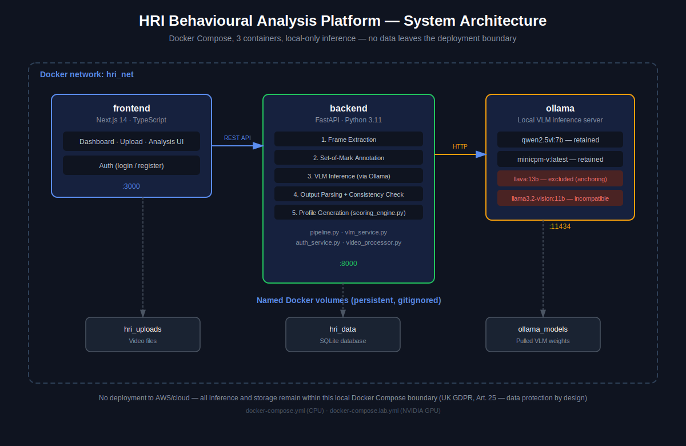

# HRI Explainable Behaviour Analysis Platform

**MSc Cloud Computing — University of Lincoln**
**Supervisor:** Dr Francesco Del Duchetto
**Author:** Agaba Solomon Amogo

---

## Overview

A research platform for **explainable, ADOS-grounded behavioural profiling of child–robot interaction video**, using locally-run Vision-Language Models (VLMs) with Set-of-Mark (SoM) visual prompting.

The pipeline codes six visual behavioural indicators per session and produces a deviation-from-typical profile summary with a natural-language explanation — **not** a diagnostic prediction. See the accompanying dissertation for the full evidence base, validation methodology, and the reasoning behind every design decision summarised below.

> ⚠️ **Research use only.** Not a medical device. Not validated for clinical use under UKCA/CE marking. All outputs require review by a qualified clinician.

## Behavioural indicators

| Category | Indicator | Source |
|---|---|---|
| ADOS-grounded | Eye Contact | ADOS Item 1 |
| ADOS-grounded | Directed Expressions | ADOS Item 2 |
| ADOS-grounded | Descriptive Gestures | ADOS Item 4 |
| ADOS-grounded | Hand & Finger Mannerisms | ADOS Item 6 |
| HRI Extension | Joint Attention | — |
| HRI Extension | Postural Orientation | — |

ADOS Items 3 and 5, and a "Multimodal Sync" HRI metric, were removed during development — all three require speech/audio understanding this visual-only system does not have. AQ-10 prediction and SHAP attribution were also removed: no published, validated formula exists for predicting AQ-10 from visual-only indicators, and the AQ-10 labels available for this project's dataset were confirmed, in consultation with the supervisor, not to be valid clinical ground truth. Explainability is instead provided by a deviation-from-typical profile ranking across the six retained indicators. See the dissertation's Methodology and Implementation chapters for the full reasoning and evidence.

## Why local-only inference (no cloud deployment)

All VLM inference runs **entirely on local/lab hardware via Ollama** — no video, frame, or derived data is ever sent to a third-party cloud API. This is a deliberate architectural decision on UK GDPR grounds, given the dataset contains special-category data (video of children aged 6–11) collected under an approved University of Lincoln ethics protocol. This project does **not** deploy to AWS or any public cloud; that trade-off, and its relevance to the MSc Cloud Computing programme, is discussed explicitly in the dissertation (Methodology, Scope Evolution).

## Models evaluated

| Model | Status | Notes |
|---|---|---|
| `qwen2.5vl:7b` | ✅ Retained | Low internal-consistency-flag rate after prompt refinement (8.6%) |
| `minicpm-v:latest` | ✅ Retained | Low internal-consistency-flag rate after prompt refinement (6.8%) |
| `llava:13b` | ❌ Excluded | Persistent internal-contradiction anchoring (~95–100% of frames), confirmed under two independent isolated test runs, not resolved by prompt tightening |
| `llama3.2-vision:11b` | ❌ Excluded | `mllama` architecture not supported by this Ollama build's inference engine (0% valid output across all attempts) |

Full evidence for these exclusions is in the dissertation's Implementation chapter (debugging log) and Results & Discussion.

## Architecture

Three containerised services via Docker Compose — no Kubernetes, no managed cloud database, by design (see above):

```
[Video Upload] → [Frame Extraction] → [SoM Annotation] → [VLM Inference] → [Output Parsing] → [Profile Generation]
```

- **`backend`** — FastAPI (Python 3.11), async. Orchestrates the pipeline, computes behavioural scores via `scoring_engine.py`, serves the REST API. SQLite for persistence (`backend/data/hri.db`).
- **`frontend`** — Next.js 14 (TypeScript, App Router). Dashboard for uploading sessions, selecting a VLM, running analysis, and reviewing results.
- **`ollama`** — Local VLM inference server.

### Architecture Diagram

## Quick start

### Prerequisites
- Docker Desktop (WSL2 backend on Windows)
- ~10–20GB free disk space per VLM you pull
- An NVIDIA GPU is optional — see "Two Compose configurations" below

### Setup

```bash
git clone https://github.com/Amogo-solomon/hri-neurodevelopmental-screening.git
cd hri-neurodevelopmental-screening
cp .env.example .env
```

**Edit `.env`** before starting — at minimum set a real `SECRET_KEY` (generate one with `python -c "import secrets; print(secrets.token_hex(32))"`) and your own `FIRST_ADMIN_EMAIL`/`FIRST_ADMIN_PASSWORD`.

```bash
docker compose up -d --build
```

### Two Compose configurations

| File | Use when |
|---|---|
| `docker-compose.yml` | Default — runs on **any machine**, CPU-only, no GPU required. Use this to guarantee it runs regardless of hardware. |
| `docker-compose.lab.yml` | For a machine with a working NVIDIA GPU + WSL2 CUDA support (e.g. the University of Lincoln GPU lab, RTX 4070). Faster inference. |

To use the GPU version, add `-f docker-compose.lab.yml` to every Compose command:
```bash
docker compose -f docker-compose.lab.yml up -d --build
```

### Pull the models you need

```bash
docker exec hri_ollama ollama pull qwen2.5vl:7b
docker exec hri_ollama ollama pull minicpm-v
```

Confirm what's pulled at any point with:
```bash
docker exec hri_ollama ollama list
```

### First login

Log in with `FIRST_ADMIN_EMAIL` / `FIRST_ADMIN_PASSWORD` exactly as set in your `.env`. If login ever fails unexpectedly on a fresh setup, register a new account directly via the **Register** page instead — this path is independently verified working.

If you ever change `FIRST_ADMIN_EMAIL`/`FIRST_ADMIN_PASSWORD` after the first run, they won't take effect until the database is reset (the admin account is only seeded once, on an empty database):
```bash
docker exec hri_backend rm -f /app/data/hri.db
docker compose restart backend
```

### Access

- Frontend: http://localhost:3000
- Backend API: http://localhost:8000

## Project structure

```
hri-platform/
├── backend/
│   ├── app/
│   │   ├── api/v1/endpoints/   # FastAPI routes (auth, upload, analysis, health)
│   │   ├── services/           # pipeline.py, vlm_service.py, scoring_engine.py
│   │   ├── models/             # SQLAlchemy models
│   │   ├── schemas/            # Pydantic schemas
│   │   └── core/               # config.py (settings, allowed VLM models)
│   └── requirements.txt
├── frontend/
│   └── src/
│       ├── app/                # Next.js pages (login, dashboard, admin)
│       ├── components/         # analysis/, dashboard/, auth/ components
│       ├── lib/                # API client
│       └── store/              # Zustand state
└── docker-compose.yml
```

## Data handling

Uploaded videos, extracted frames, and exported analysis results are **excluded from version control** (see `.gitignore`) — this repository contains code only, never participant data. Video data used during development was collected under an approved University of Lincoln ethics protocol with informed guardian consent and full anonymisation.

## Compliance notes

- **UK GDPR Art. 25 (data protection by design):** enforced architecturally via local-only inference, not a policy statement alone.
- **UK GDPR Art. 5(1)(c) (data minimisation):** no data leaves the local deployment boundary at any pipeline stage.
- This system produces research data that could inform clinical judgement — it is not a diagnostic tool, and any real-world application would require substantial further validation under appropriate clinical oversight.

## Status

This is a research prototype developed for an MSc dissertation, evaluated on a 5-session, 2-model dataset (324 frames) with a complete, blind, frame-level human validation exercise. It is not production software. See the dissertation for full validation results, limitations, and future work.